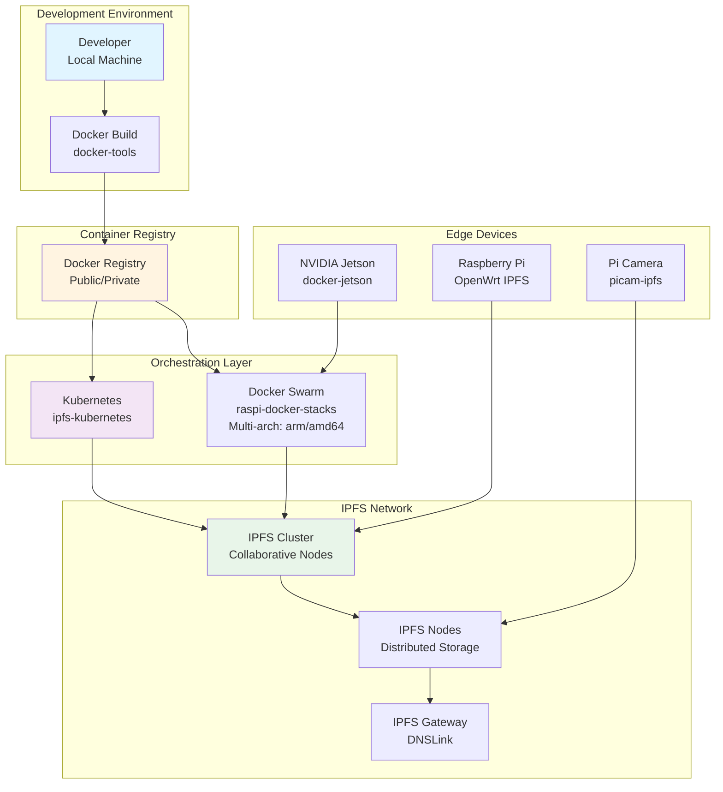
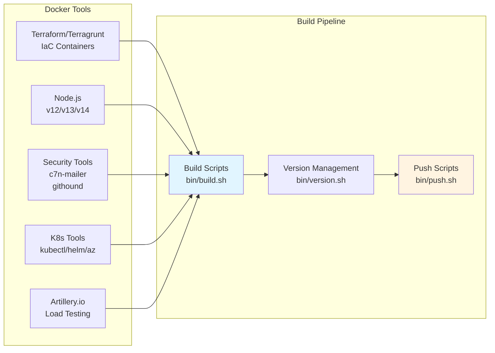

# Docker & IPFS Projects

> Consolidated repository for Docker and IPFS infrastructure projects

## 📋 Overview

This repository consolidates various Docker and IPFS-related projects, including containerization tools, IPFS deployments, and infrastructure automation.

## 🏗️ Architecture

### Docker & IPFS Infrastructure Architecture



### Docker Tools Architecture



## 📁 Projects

### Docker Tools

- **[docker-tools](./docker-tools/)** - Docker tooling for multiple use cases
  - Kerberos Docker images
  - Terraform/Terragrunt containers
  - Node.js containers (v12, v13, v14)
  - Security tools (c7n-mailer, githound)
  - Kubernetes tools (kubectl, helm, az)
  - Artillery.io for load testing

### IPFS Projects

- **[ipfs-kubernetes](./ipfs-kubernetes/)** - Dockerized IPFS using Kubernetes
- **[ipfs-cluster](./ipfs-cluster/)** - Collaborative clusters and DNSLink for IPFS-based Web
- **[OpenWRT-IPFS](./OpenWRT-IPFS/)** - IPFS in Raspberry Pi based on OpenWrt/Untangle/pfsense
- **[picam-ipfs](./picam-ipfs/)** - Raspberry Pi camera data repository using IPFS

### Infrastructure

- **[raspi-docker-stacks](./raspi-docker-stacks/)** - Collection of Docker Stacks for multi-architecture Docker Swarm cluster (arm, amd64)
- **[docker-jetson](./docker-jetson/)** - Docker images for NVIDIA Jetson devices

## 🚀 Quick Start

### Prerequisites

- Docker installed
- Docker Compose (for some projects)
- Kubernetes cluster (for IPFS Kubernetes deployment)

### Building Docker Images

Navigate to the specific project directory and follow the build instructions in each project's README.

Example:

```bash
cd docker-tools/terraform
docker build -t terraform:latest .
```

### IPFS Setup

For IPFS-related projects, ensure IPFS is installed and running:

```bash
ipfs init
ipfs daemon
```

## 📖 Project Structure

```
docker-ipfs-projects/
├── docker-tools/          # Various Docker tooling
│   ├── kerberos/
│   ├── terraform/
│   ├── nodejs/
│   └── ...
├── ipfs-kubernetes/       # Kubernetes IPFS deployment
├── ipfs-cluster/          # IPFS cluster setup
├── OpenWRT-IPFS/          # OpenWrt IPFS integration
├── picam-ipfs/            # Raspberry Pi camera IPFS
├── raspi-docker-stacks/   # Multi-arch Docker stacks
└── docker-jetson/         # Jetson Docker images
```

## 🔧 Features

- **Multi-architecture Support**: ARM and AMD64 support for Raspberry Pi and x86_64 systems
- **Security Tools**: Integration of security scanning and monitoring tools
- **Infrastructure Automation**: Terraform and Terragrunt containers for IaC
- **IPFS Integration**: Various IPFS deployment patterns and use cases

## 📚 Documentation

Each project contains its own README with detailed documentation:
- [docker-tools](./docker-tools/) - Docker tooling documentation
- [ipfs-cluster](./ipfs-cluster/) - IPFS cluster setup guide
- [OpenWRT-IPFS](./OpenWRT-IPFS/) - OpenWrt IPFS integration guide

## 🔒 Security Considerations

- All Docker images should be built from trusted base images
- Regularly update base images for security patches
- Use secrets management for sensitive configuration
- Follow Docker security best practices

## 📝 License

Please refer to individual project licenses.

## 👤 Author

**Twodragon**
- GitHub: [@Twodragon0](https://github.com/Twodragon0)
- Blog: [twodragon.tistory.com](https://twodragon.tistory.com)

## 🤝 Contributing

Contributions are welcome! Please feel free to submit a Pull Request.

---

**Last updated:** 2025-12-27
